```{r setup, include=FALSE}
library(knitr)
knitr::opts_chunk$set(tidy = FALSE, 
                      message = FALSE,
                      warning = FALSE,
                      echo = FALSE, 
                      #fig.width=8,
                      #fig.height=6,
                      fig.align = "center",
                      fig.retina = 2)
options(htmltools.dir.version = FALSE)
options(kableExtra.latex.load_packages = FALSE)
options(knitr.table.format = "latex")
library(magick)
library(latex2exp)
library(tidyverse)
library(kableExtra)
library(htmltools)
# /home/user1/Desktop/Images for thesis/
# #003366
#<font size="10"></font> or <p font-size:12pt></p>
#<center> <h1>  </h1> </center> ***
```


layout: true
  
<div class="my-header"></div>

<div class="my-footer"><span>Kenji Macfarlane   
&emsp;&emsp;&emsp;&emsp;&emsp;&emsp;&emsp;&emsp;&emsp;&emsp;&emsp;&emsp;&emsp;
&emsp;&emsp;&emsp;&emsp;&emsp;&emsp;&emsp;&emsp;
Signal and Background discrimination of the top squark production
&emsp;&emsp;&emsp;&emsp;&emsp;&emsp;&emsp;&emsp;&emsp;&emsp;&emsp;&emsp;
&emsp;&emsp;&emsp;&emsp;&emsp;&emsp; 26006480 </span></div> 

```{css, echo=FALSE}
/* custom.css */
.large { font-size: 150% }
.largeish { font-size: 120% }
.summarystyle { font-size: 150%;
  line-height:150%;}
.medium { font-size: 80% }

ifram {
  border: 0px,
  width: 100%,
  
}
```

```{r, load_refs, include=FALSE, cache=FALSE}
library(RefManageR)
BibOptions(check.entries = FALSE,
           bib.style = "authoryear",
           cite.style = "alphabetic",
           style = "markdown",
           hyperlink = TRUE,
           dashed = FALSE)
myBib <- ReadBib("./slides.bib", check = FALSE)
```

---
class: middle, my-outline-font

<center> <h1> Outline </h1> </center>
***
***
* The Standard Model (SM) is an elegant yet incomplete theory. We turn to the Minimum Supersymmetric Standard Model (MSSM) for new physics beyond the SM.
  + We look at the top squark (stops) decays, theorized in the MSSM to be the next potential candidate for detection in collider experiments.
* Simulate events with final states $1l^{\pm}+E_T^{Miss}+ \text{jets}(1b)$.
  + Background: $pp \rightarrow t\bar{t}$
  + Signal: $pp \rightarrow \tilde{t}\tilde{t}^* \rightarrow t\bar{t}\tilde{\chi}_1^0\tilde{\chi}_1^0$
* Use Machine Learning to discriminate background and signal events.
  + Visualise the data with a guided <em>tourr</em> to understand the differences in these events. 

---
class: middle, center

<center> <h2> The Standard Model and the Minimum Supersymmetric Standard Model </h2> </center>
***
.center[
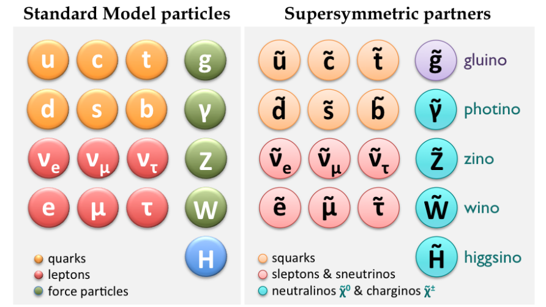
<br>
[ATLAS Silicon IFIC](https://ific.uv.es/sct/physics_susy)
]


---
class: middle

<center> <h1> $t$ and $\bar{t}$ decays </h1> </center>
***
.pull-left[
<br><br>
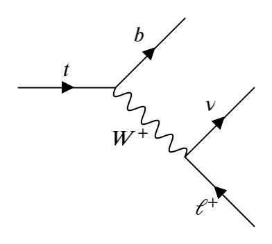 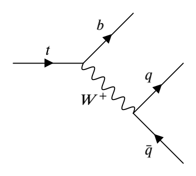
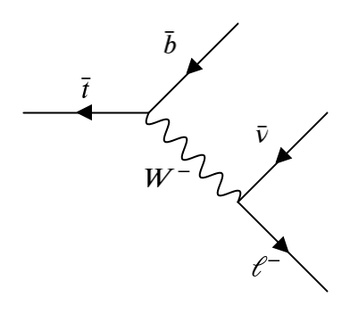 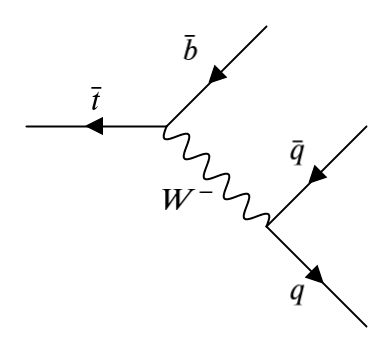
]


<br><br>
* The top quark will almost always decay to $b+W^\pm$ then into leptons/hadrons.
* We are interested in the one-(charged)lepton final states.


---
class: middle
<center> <h2> The top squark decay </h2> </center>
***
.center[
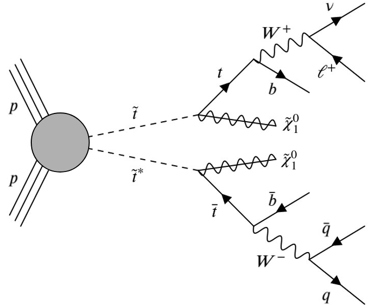 
]

* Recall that $\tilde{\chi}_1^0$ is the neutralino, a composition of the neutral components of the fermionic superpartners (Higgsino etc.) of the bosons (excluding the gluon) in the SM. We assume it is the lightest particle and does not decay any further.
 + The SM neutrino and the MSSM neutralino will be referred to as the Missing (Transverse) Energy $(E_T^{Miss})$ from, here on.

---
class: middle, center
<center> <h2> Exclusion limits by the [CMS](#bib-cms2019search) : [CMS-PAS-SUS-19-009](http://inspirehep.net/record/1743675?ln=en) </h2> </center>
***
.center[
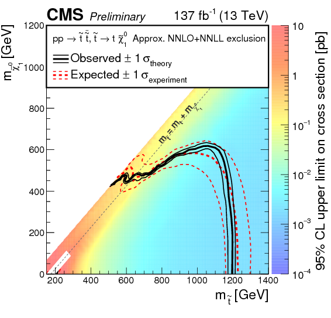
] 

```{r, message=FALSE, echo=FALSE, include = FALSE}
 Citep(myBib, eprinttype = "arxiv", c("cms2019search"), .opts = list(cite.style = "numeric"))
```
---
class: middle, center, inverse

# Method

---
class: middle, center
<center> <h2> Chosen parameters for building our models </h2> </center>
***
.center[
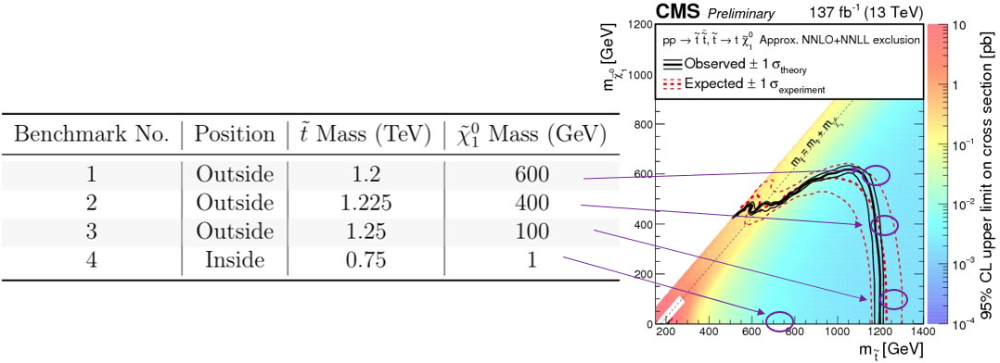
]

Inside the exclusion curve to do a check with respect to the paper by [Roxlo and Reece, 2018](#bib-roxlo2018opening) [(arXiv:1804.09278)](https://arxiv.org/abs/1804.09278)

```{r, message=FALSE, echo=FALSE, include = FALSE}
 Citep(myBib, eprinttype = "arxiv", c("roxlo2018opening"), .opts = list(cite.style = "numeric"))
```

---
class: middle
<center> <h2> Simulations </h2> </center>
***
Simulations are performed using [MadGraph5](#bib-alwall2011madgraph) with its built-in interface to [Pythia](#bib-sjostrand2015introduction) and [Delphes](#bib-de2014delphe).
  + Events must satisfy $E_T^{\text{Miss}}>200$ GeV.
  + Pythia to simulate parton showers and hadronisation.
  + Delphes to simulate detectors (CMS), with efficiencies chosen following identical numbers to CMS experiments. The efficiencies allow us to detect isolated electrons and muons. reconstruct the jets and tag potential b-jets. 
      + Note that many useful detector variables are constructed in the transverse plane (x-y) to the beam axis (z).
.center[
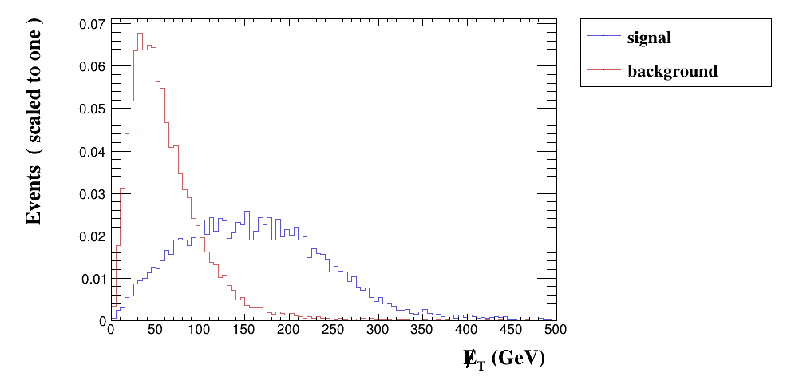 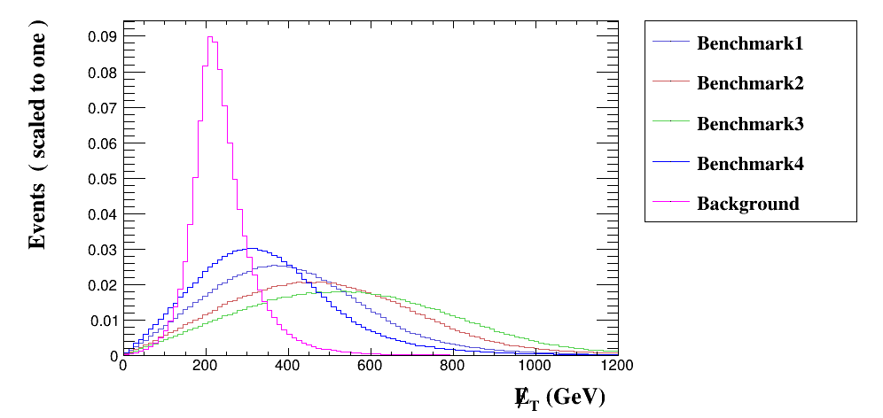
]
  
  


```{r}
#.center[
#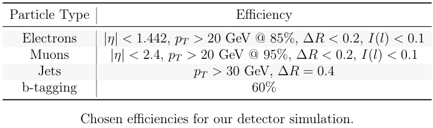
#<br>
#The isolation variable: $I(l) = \frac{\sum\limits_{i\ne l}^{R<\Delta R} p_T(i)}{p_T(l)}$

#* XGBoost is an extension to <em>Gradient Boosted Machines (GBM)</em>.
#  + <em>Boosting</em> is an iterative algorithm: Build weak models that build sequentially into  stronger models by improving on its preceding model.
#  + Gradient Boosting reduces the errors locally using a differentiable loss-function's gradient (gradient descent).
#  + GBMs consider all candidate split points, whereas XGBoost considers weighted quantiles (it approximates the split points with weights).
#  + XGBoost manages sparse data better than regular GBMs and incorporates parallel computing.

#+ Optimize the algorithm by performing a grid-search of hyperparameters using cross-validation.
```

```{r, message=FALSE, echo=FALSE, include = FALSE}
 Citep(myBib, eprinttype = "arxiv", c("alwall2011madgraph","sjostrand2015introduction","de2014delphes"), .opts = list(cite.style = "numeric"))
```
---
class: middle
<center> <h2> Building our classifiers </h2> </center>
***
The datasets are created by extracting the <span style="color:blue">energy/momentum, $\phi$ (azimuthal) and $\eta$ (longitudinal) components of $E_T^{\text{Miss}}$, $2l^{\pm}$, 4 jets with a minimum of 1 b-tagged jet, as well as the scalar energy $H_T$</span>.

We perform pre-selection, requiring that:
* $E_T^{\text{Miss}}>250$ GeV,
* Only one charged lepton (with no sign discrimination),
* The b-tagged jet with highest $p_T$ will be our only $b$-jet,
* Remaining jets considered as regular jets regardless of their tag.

The data can then be created into a 50:50 split between the background and signal events.

<br>
We partition our remaining data into 2/3 training and 1/3 test.
  + Use a tree-based algorithm called '[XGBoost](#bib-xgboost)' in [R](#bib-R) due to its reliable high performance.
  + The algorithm also ranks the variables used, allowing us to see what variables are most important and consistantly used. 
  
```{r, message=FALSE, echo=FALSE, include = FALSE}
Citep(myBib, eprinttype = "arxiv", c("xgboost", "R"), .opts = list(cite.style = "numeric"))
```

---
class: middle
<center> <h2> Tree-based algorithms </h2> </center>
***
.left-col-50[
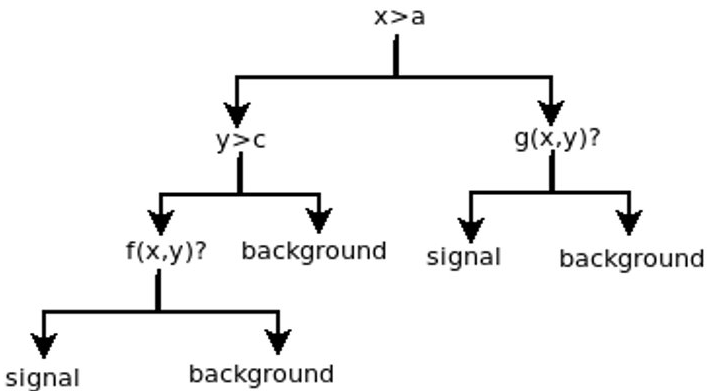
<br>
<br>
]

.right-col-50[
It is a form of supervised learning and requires labeled data (hence the simulation) to build the classifier and make predictions on the test data.


The algorithm creates a tree through splits performed on certain criteria. This process is a black box and we cannot actually see what criteria the algorithm chooses, as the algorithm creates splits based on some error/loss-function it attempts to minimize.
]


---
class: middle, center, inverse

## How did our classifiers perform?

---
class: middle

.left-col-50[
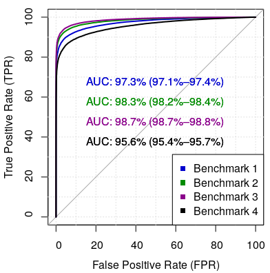
<br><br>
All four benchmark points had very good accuracy. But this isn't enough in understanding the physics.
]
<br>
.right-col-50[
* Use a different metric; the <em>approximate median significance</em>. [Higgs Challenge, 2014](#bib-adam-bourdarios_learning_2014)
<br>
AMS = $\sqrt{2\Big((s+b+b_r)\ln\Big(1+\frac{s}{b+b_r}\Big)\Big)-s}$, 
<br>
where $s(b)$ are the number of espected signal(background) and $b_r=10$ is the constant regularization term. 

* The values are obtained by $s(b)=N_{s(b)}\times\epsilon_{s(b)}$ <br>
where $N_{s(b)}=\sigma \int L(t)dt$ for some cross-section $\sigma$ (pb) and the integrated luminosity, given as  $137 \text{fb}^{-1}$. The efficiency $\epsilon_{s(b)}$ is the correctly and incorrectly classified signal events in the training set.

* This relates to the statistical significance in which the likelihood of discovery for the events of interest are measured.
  + [Roxlo and Reece, 2018](#bib-roxlo2018opening) had AMS = 1.72 using an integrated luminosity of $35.9 \text{fb}^{-1}$.
]


```{r, message=FALSE, echo=FALSE, include = FALSE}
Citep(myBib, eprinttype = "arxiv", c("tourr"), .opts = list(cite.style = "numeric"))
```

---
class: middle
.center[
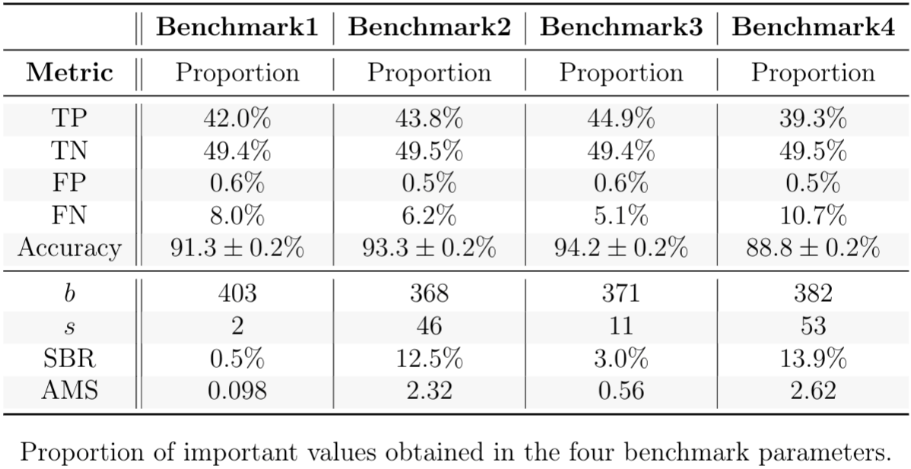
]

In addition, the top five variables according to the classifiers seem to consistantly be the $E_T^{\text{Miss}}$ (magnitude and $\phi$), Lepton $(p_T\text{ and } \phi)$ and $H_T$.
---
class: middle, center, inverse

## Taking a 'tourr' through the results

---
class: middle
<center> <h3> Inside the curve: $\tilde{t} = 750$ GeV and $\tilde{\chi}_1^0 = 1$ GeV </h3> </center>
***
.left-col-50[
```{r, out.width='90%', out.height='90%'}
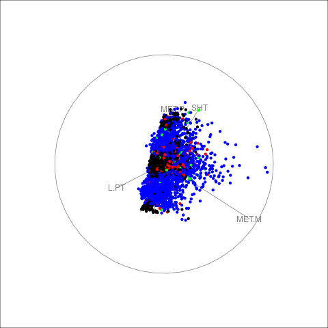
```
]

.right-col-50[
* <em>[tourr](#bib-tourr)</em> is a package that allows us to take a two-dimensional projection of a high-dimensional data as an animation. By specifying an index, the algorithm searches for projections that separate clearly distinguished groups.
  + The <em>alpha hull</em>, a form of convex hull, is chosen as the index. 
<br><br>
* Variables used are: $E_T^{\text{Miss}}$ (magnitude and $\phi$), Lepton $(p_T\text{ and } \phi)$, $H_T$, $b$-jet's $p_T$ and the highest $p_T$ jet remaining.
<br><br>
* Correctly classified points:
  + <span style="color:blue">Signal = True Positives (TP)</span>, in <span style="color:blue">Blue</span>
  + Background = True Negatives (TN), in Black
<br>
* Misclassified points:
  + <span style="color:red">Signal = False Negatives (FN)</span>, in <span style="color:red">Red</span>
  + <span style="color:green">Background = False Positives (FP)</span>, in <span style="color:green">Green</span>
]

---
class: middle
  
Same data and tour, now with falsely predicted points highlighted.<br>
Variables used are: $E_T^{\text{Miss}}$ (magnitude and $\phi$), Lepton $(p_T\text{ and } \phi)$, $H_T$, $b$-jet's $p_T$ and the highest $p_T$ jet.<br>
Misclassified points: <span style="color:red">Signal = False Negatives (FN)</span>, <span style="color:blue">Background = False Positives (FP)</span>

<iframe src="bm_I_highlighted.html" width="1100" height="550" scrolling="yes" seamless="seamless" frameBorder="0"> </iframe>

---
class: middle

Same data, now with only falsely predicted points.<br>
Variables used are: $E_T^{\text{Miss}}$ (magnitude and $\phi$), Lepton $(p_T\text{ and } \phi)$, $H_T$, $b$-jet's $p_T$ and the highest $p_T$ jet.<br>
Misclassified points: <span style="color:red">Signal = False Negatives (FN)</span>, <span style="color:blue">Background = False Positives (FP)</span>
  
<iframe src="fpfn_I.html" width="1100" height="550" scrolling="yes" seamless="seamless" frameBorder="0"> </iframe>


---
class: middle
<center> <h1> Summary </h1> </center>
***
***
* The MSSM is a candidate to explain physics beyond the SM, with the top squarks (stops) being a potential candidate particle for the next detection.
* In the process $pp \rightarrow \tilde{t}\tilde{t}^* \rightarrow t\bar{t}\tilde{\chi}_1^0\tilde{\chi}_1^0$, the signal (stops) and background (tops) can be discriminated well with ML models.
* Visualising the data with <em>tourr</em> helps us to understand how the data is distributed in various ways.
  + It seems the Missing Transverse Energy's magnitude and $\phi$ component as well as Leptons along their $\phi$ components give an interesting distribution of the events in all of the datasets. The remaining variables did not seem to contribute much to such behavior of these events.

* Machine learning is an already widely used tool in collider physics, so it is important to explore the nature of the results obtained by machine learning algorithms, using tools such as the guided <em>tourr</em>. In future, it would be good to explore further datasets not limited to the decay explored in this project.

---
class: middle, center
# Acknowledgement
***
***
Thank you to Ursula and German for their patience and guidance throughout the year.

Thank you to Professor Di Cook from the Economics department for her guidance in visualisation.

Thank you for listening!!

---
class: middle
# References

```{r refs, echo=FALSE, results="asis"}
PrintBibliography(myBib, .opts = list(cite.style = "authoryear"))
```
